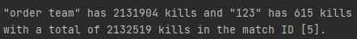
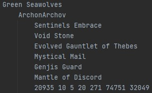

# projectSMITE

#### Made by Jonathan Navarro
This java project was made for learning purposes with also the objective of manage different data types with the use of interactive menus.

---

It starts executing at Main.java to then enter to an instance of MainMenu, at the main menu is possible to access to Data, Matches, 
Score menus and a Team Randomizer made for fun.

---
### Data

Data menu allows the user to create a new object Match defining its composed data types, modify a currently 
registered match, delete a currently registered match and import predefined matches to try the other tools.

---
### Data types
+ Statistics: it holds information of a player in each match, all the information that can be saved is: the items 
of the player as a vector of String, gold, kills, deaths, assists, structure, minion and player damages as integers.
+ Teammate: it's the player of each team, which contains its ID as a String and its Statistics.
+ Team: it's one of the two teams playing a match, and it contains its name and a vector of five teammates.
+ Match: this object contains two teams labelled as "Order" and "Chaos", as well as the duration in minutes as an integer.
+ Season: it initializes at the execution of the program and contains a vector of matches that can be modified.

---
### Matches

Matches menu allows the user to print at the screen all the information of a match or all the players that are 
registered on each team on the selected match.

---
### Score

Score menu allows the user to show data of all the registered matches, or a specific match in a predefined way.

Score menu has another submenu to show information of a chosen match.

Here is an example of the output of the total kills of a match:

---
### Team randomizer

Team randomizer option of the main menu allows the user to create random teams for up to ten total players.

---
### IO class and data management

IO class (./misc/IO.java) calls to the instance method .loadData() of an object IO, previously initialized 
and imported to the Main class, before the execution of the main menu. The data is saved on a single file 
(./data/save.txt) and if this file or its parent directory don't exist, the loading process will automatically 
create the folder and file.

---
#### Save, load and format of data

The data is saved when the program finishes its execution successfully from the main menu. Before that, 
the program asks the user if is willing to save the data, removing the last save file to create a new one 
in the process.

If the user chooses to not save data, the program will simply end its execution. This program uses instance 
methods from an object IO to run the procedures to load and save data. Then calls for private instance methods 
to run subsequent tasks, writing each match, team, player and its statistics or loading it from an object Path 
initialized with the path of ./data/save.txt.

---
#### Format of the save file

In the "./data/save.txt" file the format of the data saved is as follows:

-Team Name- as a String with spaces

Five players with the next format:

    -Player's Nickname- as a String
        -Six Items- as a vector of String with spaces
        -Gold, Kills, Deaths, Assists, Structure, Minion and Player's Damages- all as integers

Another team with the same format as above.

-Match Duration In Minutes- as an integer